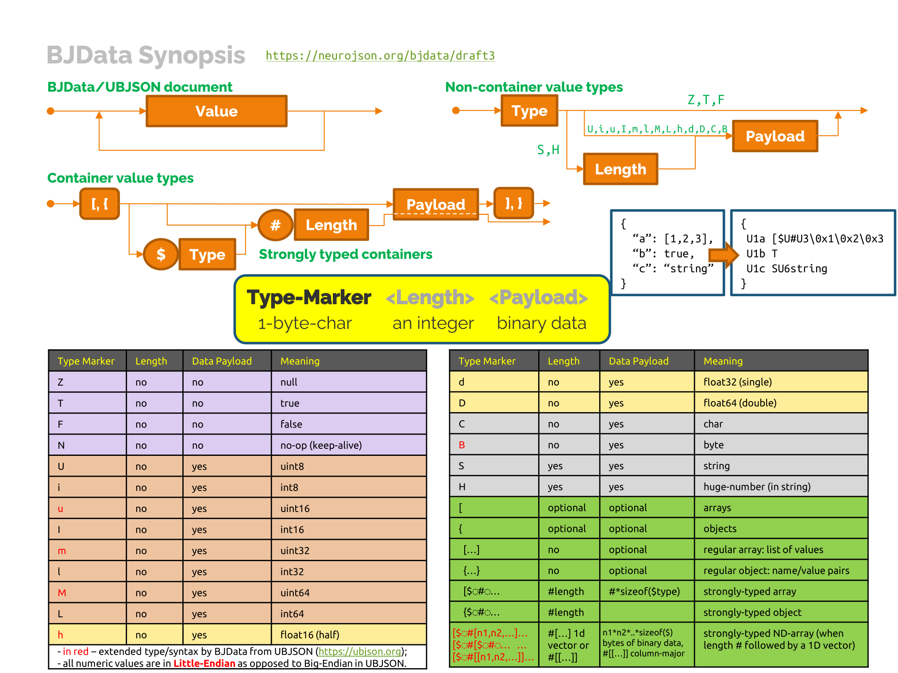

# Binary JData Format Specification Development Guide

We use this repository to gather feedback from the community regarding the 
["Binary JData Format Specification"](Binary_JData_Specification.md), or 
Binary JData (**BJData**) format. Such feedback is crucial to finalize this file 
specification and help improve it in the future once disseminated.

The latest version of the BJData specification can be found in the file named 
[Binary_JData_Specification.md](Binary_JData_Specification.md). The specification is written
in the [Markdown format](https://github.com/adam-p/markdown-here/wiki/Markdown-Cheatsheet) 
for convenient editing and version control.

This specification was derived from the Universal Binary JSON (UBJSON) Specification
[Draft 12](https://github.com/ubjson/universal-binary-json/tree/master/spec12)
developed by Riyad Kalla and other UBJSON contributors. The MarkDown version 
of this specification was derived from the documentation included in the 
[Py-ubjson](https://github.com/Iotic-Labs/py-ubjson/blob/dev-contrib/UBJSON-Specification.md)
repository (Commit 5ce1fe7). **The BJData format is no longer backward compatible with UBJSON.**

Libraries that support this specification include
- Python: **pybj** (PIP:  https://pypi.org/project/bjdata/, GitHub: https://github.com/NeuroJSON/pybj)
- MATLAB/Octave: **JSONLab** (Debian/Ubuntu/Fedora: `sudo apt-get install octave-jsonlab`, GitHub: https://github.com/NeuroJSON/jsonlab)
- C: **ubj** (GitHub: https://github.com/NeuroJSON/ubj)
- C++: **JSON for Modern C++** (v3.11.0 or later) (https://github.com/nlohmann/json/)
- JavaScript: **bjd** (npm: https://www.npmjs.com/package/bjd, GitHub: https://github.com/NeuroJSON/js-bjdata)
- Dart: **bjdata** (pub.dev: https://pub.dev/packages/bjdata, GitHub: https://github.com/nebkat/dart-bjdata)

**Acknowledgement**: This specification was developed as part of the NeuroJSON project
(http://neurojson.org), with funding support from the US National Institute of Health (NIH) under
grant [U24-NS124027](https://reporter.nih.gov/project-details/10308329) (PI: [Qianqian Fang](http://fanglab.org)).

## What is BJData

BJData is a binary JSON format. It is similar to JSON but allows to store strongly-typed binary data.
The BJData format improves upon the widely supported UBJSON (https://ubjson.org) format by adding
the below key features

- added 4 new data types previously missing from UBJSON, including `[u] - uint16`, `[m] - uint32`, 
  `[M] - uint64` and `[h] - half/float16`,
- first among all binary JSON formats to support **packed N-dimensional arrays (ndarray)** - a data
  type that is of great importance to the scientific community,
- adopted **Little-Endian** as the default byte-order, as opposed to Big-Endian for UBJSON/MessagePack/CBOR,
- only non-zero-fixed-length data types are allowed in optimized container types (`$`), which 
  means `[{SHTFTN` can not follow `$`, but `UiuImLMLhdDCB` are allowed

## How to participate

You can use a number of methods to provide your feedback to the working 
draft of this file specification, including

- [Create an "Issue"](https://github.com/NeuroJSON/bjdata/issues)
  - This is the most recommended method to provide detailed feedback or 
    discussion. An "Issue" in github is highly versatile. One can ask a 
    question, report a bug, provide a feature request, or simply propose
    general discussions. Please use URLs or keywords to link your discussion 
    to a specific line/section/topic in the document.
- [Write short comments on Request for Comments (RFC) commits](https://github.com/NeuroJSON/bjdata/releases/tag/Draft-3)
  - The latest stable release is **[Version 1 Draft 3](https://github.com/NeuroJSON/bjdata/releases/tag/Draft-3)**
  - To add a comment, Please consider using the
    [Issues section](https://github.com/NeuroJSON/bjdata/issues)
  - One can browse the commit history of the specification document. If
    anyone is interested in commenting on a particular updated, you can also
    comment on any of the commit page using the same method.
- [Use NeuroJSON Forum](https://github.com/orgs/NeuroJSON/discussions)
  - You may send your comments to the neurojson Github forum. You may report
    bugs, new features, or submit new datasets.

For anyone who wants to contribute to the writing or revision of this document,
please follow the below steps

- Fork this repository and make updates, then create a pull-request
  - Please first register an account on github, then, browse the 
    [BJData Spec repository](https://github.com/NeuroJSON/bjdata);
    on the top-right of this page, find and click the "Fork" button.
  - once you fork the JData project to your own repository, you may edit the
    files in your browser directly, or download to your local folder, and 
    edit the files using a text editor;
  - once your revision is complete, please "commit" and "push" it to your forked
    git repository. Then you should create a pull-request (PR) against the upstream
    repository (i.e., `NeuroJSON/bjdata`). Please select "Compare cross forks" and 
    select `"NeuroJSON/bjdata"` as "base fork". Please write a descriptive title for
    your pull-request. The project maintainer will review your updates
    and choose to merge to the upstream files or request revision from you.
    
